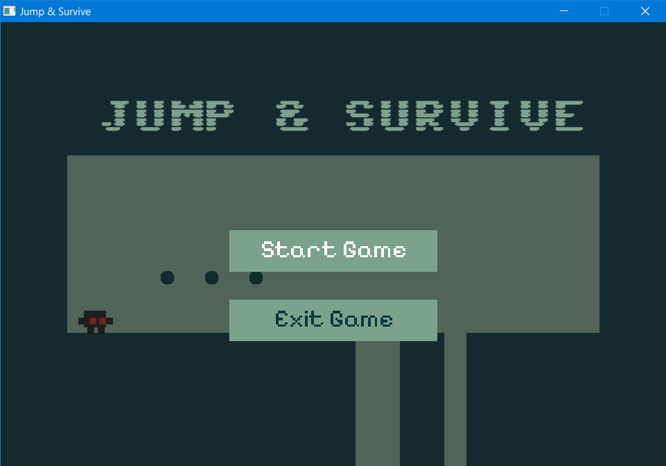
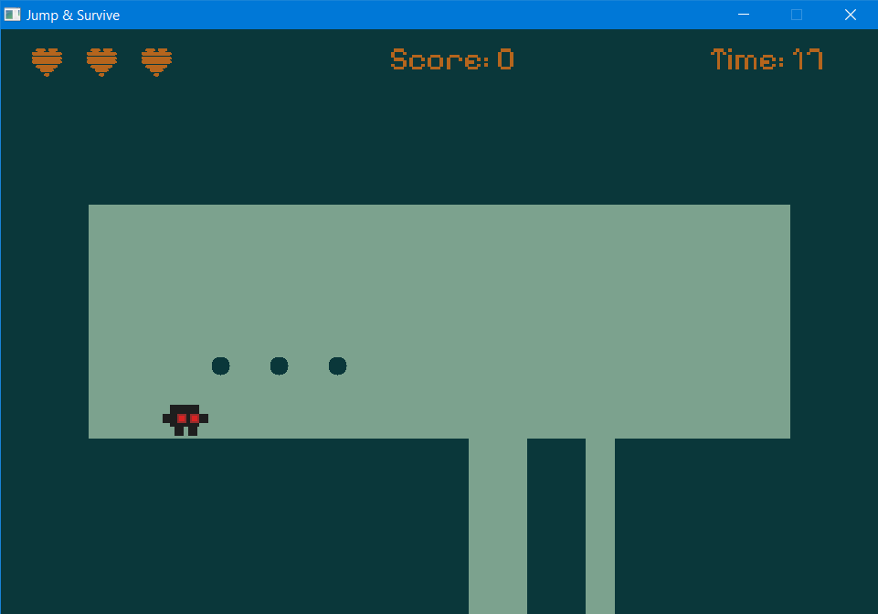
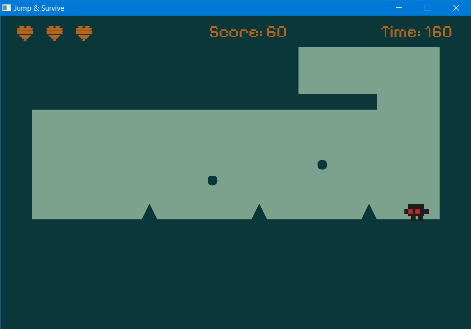
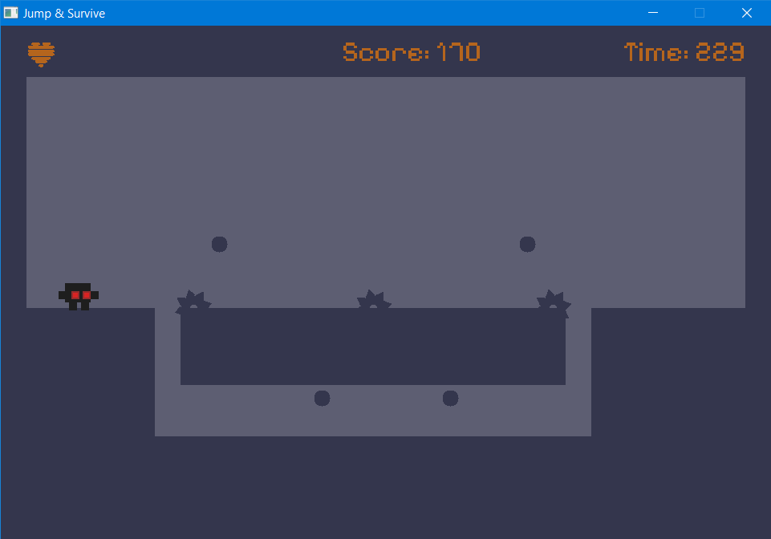
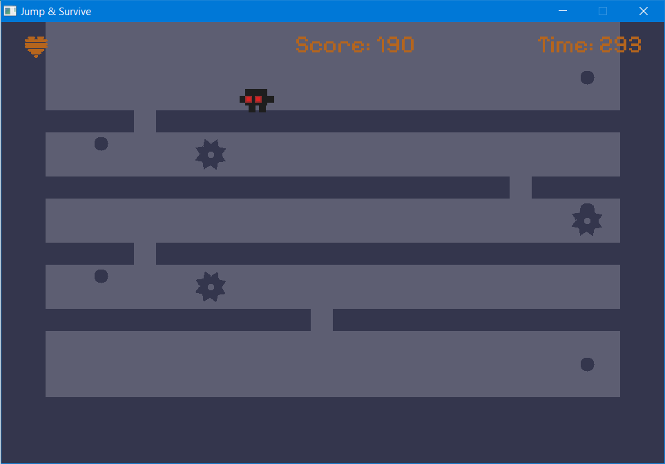
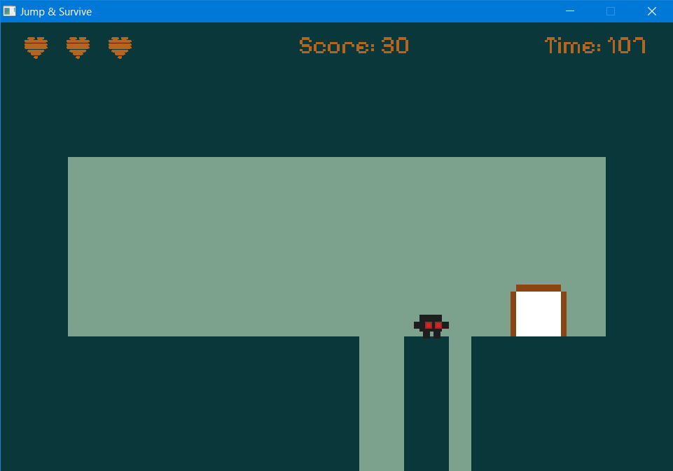
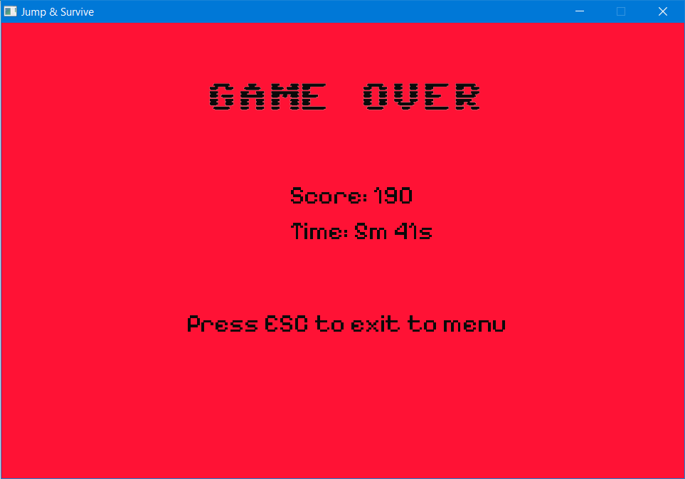
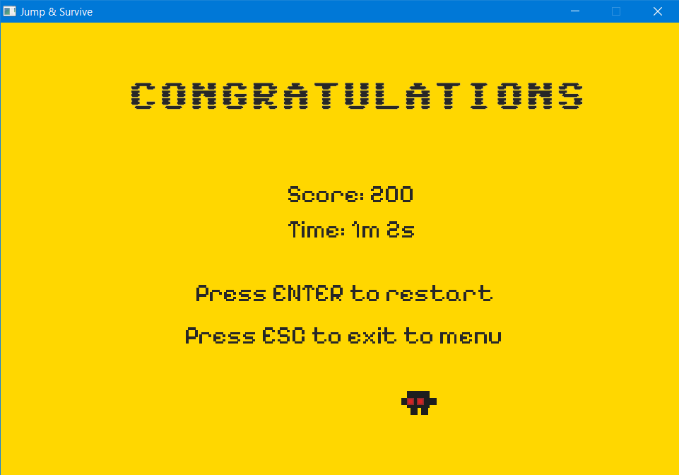
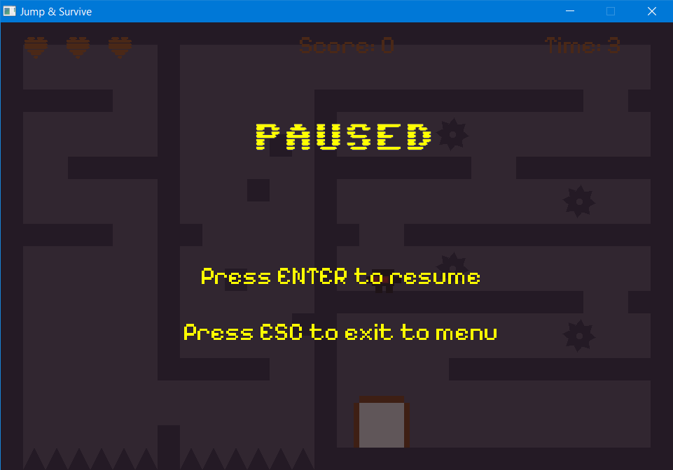

# Cara Memainkan

* Pilih **Start Game** untuk memulai permainan.
  

* Gunakan tombol **arah (Arrow Keys)** untuk bergerak ke kiri, kanan, dan melompat.
    

* **Hindari** menyentuh **void** (area kosong di bawah level) dan berbagai jenis **rintangan** seperti:
    * Spike (paku)
    * Saw (gergaji statis)
    * Moving Saw (gergaji bergerak)
    * Fake Coins (koin palsu)

    | Spike                                                 | Saw                                                   | Moving Saw                                            |
    | ----------------------------------------------------- | ----------------------------------------------------- | ----------------------------------------------------- |
    |  |  |  |

* **Kumpulkan semua koin** yang ada di setiap level untuk memunculkan gerbang keluar.
  

* Setelah semua koin terkumpul, **masuk ke gerbang** untuk melanjutkan ke level berikutnya.
* Jika pemain **terkena rintangan atau jatuh ke dalam void**, maka:
    * Nyawa pemain akan berkurang sebanyak 1.
    * Pemain akan kembali ke titik awal (spawn point) di level tersebut.
    * Jika nyawa pemain habis, maka akan muncul tampilan **Game Over**.
      

* Jika pemain berhasil melewati seluruh level dari **level 0 hingga level 10**, maka akan muncul tampilan **Congratulations**.
  

* Tekan tombol **ESC** saat berada di dalam game untuk memunculkan menu pause.
  

* Tekan tombol **ENTER** untuk melanjutkan permainan (resume) dari menu pause.
* Tekan tombol **ESC** sekali lagi saat berada di menu pause untuk kembali ke menu utama.
