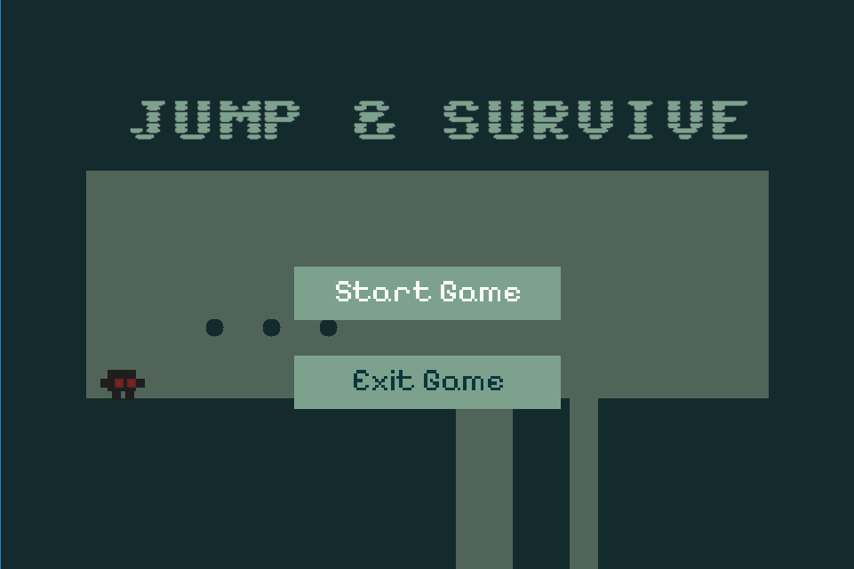

# Beranda

Selamat Datang di Jump & Survive Documentation!

## Deskripsi Singkat

**Jump & Survive** adalah game 2D platformer sederhana yang dibuat menggunakan bahasa pemrograman C dan library SDL3. Dalam game ini, pemain mengendalikan karakter utama yang harus melompat dan menghindari rintangan untuk mencapai tujuan akhir.

---

## Fitur-Fitur

1. **Kontrol Pemain**  
   Pemain dapat bergerak ke kiri, kanan, dan melakukan lompatan untuk menjelajahi level.

2. **Rintangan dan Tantangan**  
   Berbagai jenis rintangan, termasuk jebakan, spike, serta elemen lainnya yang harus dihindari.

3. **Level dengan Kesulitan yang Meningkat**  
   Dua stage dengan sepuluh level dengan distribusi rintangan, dan penempatan objek yang berbeda-beda. Setiap level menawarkan tantangan baru dengan kesulitan yang meningkat.

4. **Statistik Permainan**  
   Game Stats / Statistik pemain, seperti skor, nyawa, dan waktu permainan, dicatat dan ditampilkan melalui antarmuka pengguna (UI).

5. **Sistem Tile Map Berbasis Array 2D**  
   Tile system menggunakan array 2D untuk merepresentasikan map secara grid.

6. **User Interface & Menu Utama**  
   Tampilan menu utama. Selain itu, terdapat tampilan pause, game over, dan level transition.

---

## Teknologi yang Digunakan

- **Bahasa Pemrograman**:
    - C
- **Library**:
    - [**Simple DirectMedia Layer 3 (SDL3)**](https://wiki.libsdl.org/SDL3/FrontPage)
    - [**cJSON**](https://github.com/DaveGamble/cJSON)
- **Build Tools**:
    - [**GNU Make**](https://www.gnu.org/software/make/)
    - [**GNU Compiler Collection (GCC)**](https://packages.msys2.org/packages/mingw-w64-x86_64-gcc)
- **Version Control System**:
    - [**Git**](https://git-scm.com/)

Teknis pengembangan dan dokumentasi lebih lanjut dapat dilihat pada [Teknis Pengembangan](./development/index.md).

---

## Cara Menjalankan

Untuk instalasi dan penggunaan, kunjungi [Cara Menjalankan Program](./usage.md)

---

## Cara Memainkan

Kunjungi [Cara Memainkan](./how-to-play.md)
